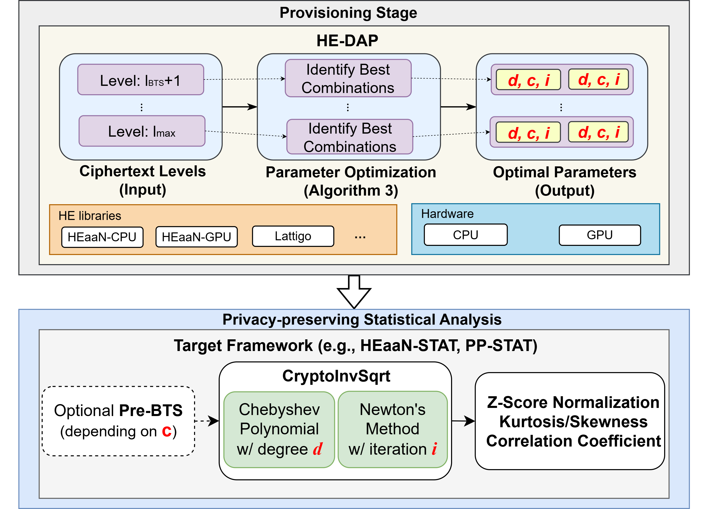

# HE-DAP: Homomorphic Encryption-based Dynamic Adaptive Parameter Optimization for Statistical Computation

# 

Official repository for **HE-DAP: Homomorphic Encryption-based Dynamic Adaptive Parameter Optimization for Statistical Computation**  

HE-DAP is a new method that determines the optimal parameters of the inverse square root function proposed in PP-STAT. It includes the implementations of parameters optimizer, and 4 statistial analyses:

- Z-Score Normalization
- Skewness
- Kurtosis
- Pearson Correlation Coefficient (PCC)

In this repository, only the code implemented on Lattigo is available, while the code based on HEaaN cannot be released public due to the restrictions of the HEaaN license.

## Abstract
Homomorphic encryption (HE) enables privacy-preserving analytics but remains hindered by high computational overhead. We find that the inverse square root—a key primitive in many statistical and machine learning workloads—exhibits inconsistent and often suboptimal performance across HE libraries and hardware. This stems from a core trade-off between two costly HE operations: evaluating high-degree Chebyshev polynomials to speed up Newton’s method versus performing bootstrapping to manage ciphertext noise. Because their relative costs vary by up to 6× across environments, any fixed configuration proves inherently inefficient. \
To address this challenge, we present HE-DAP, a cross-platform optimization framework that automatically navigates this trade-off. By profiling an environment’s unique performance characteristics, HE-DAP finds the optimal balance between polynomial degree and iteration count to accelerate the encrypted inverse square root computation for a given accuracy target. Our evaluation on Lattigo, HEaaN-CPU, and HEaaN-GPU shows that HE-DAP’s adaptive approach yields significant performance gains. It accelerates the core inverse square root computation by up to 2.31× over the fixed configuration in PP-STAT while maintaining high numerical accuracy (MRE ≤ 3.1 × 10−8). We further demonstrate that optimizing this fundamental building block directly enhances the end-to-end performance of complex statistical analyses, confirming the practical benefits of our environment-aware approach. By automatically adapting to heterogeneous execution environments, HE-DAP demonstrates that principled parameter optimization can make privacy-preserving statistical analytics practical at scale.

## 1. Server Setting
- In this evaluation, Intel(R) Xeon(R) Gold 6248R CPU @3.00GHz processor, and 64GB RAM with Ubuntu 24.04 LTS.
- The experiment will work well even in any Linux environment.

## 2. Requirements
- Go: go1.23 or higher version
- Lattigo V6 library (https://github.com/tuneinsight/lattigo)

## 3. Run the optimizer
The HE-DAP's optimizer are introduced in the following directory.
./optimizer/result
In the directory, run the following command:
```bash
    go run main.go
```

## 4. Run the codes
The four experiments are introduced in the following directory.
./examples
The detailed explanation and how to run the example code is in the README.md in the example directory.

## 5. License
This is available for non-commercial purposes only.

